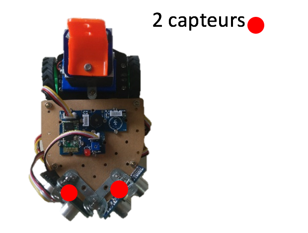

# ProjectSade

## Introduction au projet

Dans le cadre de notre spécialité ISN, nous nous sommes réunis en un groupe de trois amis, Tom, Yaël et moi-même. Après quelques séances, nous avons trouvé le thème de notre projet à partir d’une plaisanterie. Nous avons décidé d’améliorer le fauteuil roulant électrique de Yaël en l’automatisant.Nous avons donc débuté ce projet vers octobre. Nous avons réalisé 16 versions alpha et 3 beta, ainsi que 11 versions de tests divers. Constatant notre avancement rapide, notre professeur, Mme Delattre, nous proposa de participer à la finale académique des Olympiades des sciences de l’ingénieur. C’est avec une certaine appréhension mais néanmoins la volonté de réussir que nous avons accepté en axant notre production sur la composante principale de ce qui devait être notre projet d’automatisation d’un fauteuil roulant, le projet Sade. Ce dernier a pour but la création et l’adaptation à différents fauteuils roulants, d’un système de détection et d’esquive d’obstacles. Le principe est simple : le système équipé de huit capteurs (deux devant, deux à l’arrière, et deux de chaque côté, va détecter tout obstacle autour de lui et va, en fonction de leur proximité, rediriger le fauteuil pour esquiver ces obstacles. Mais par manque de moyens techniques et financiers, nous n’avons pas pu réaliser l’adaptation réelle et nous nous sommes donc contentés d’un prototype, un ShieldBot Arduinio 1.0. Cependant, sa puissance et l’espace disponible ne nous ont permis de l’équiper que de deux capteurs et d’un module Bluetooth permettant une conduite à distance.

##Présentation du projet

Nous avons donc appelé notre projet : Projet Sade (Système d’Assistance à la Détection et à l’Esquive). 
L’enjeu de notre projet est avant tout de faciliter la vie des personnes en fauteuil roulant et de limiter le risque d’accident. Notre problématique est donc : comment diminuer le risque d’accident durant un moment d’inattention ?
Ce besoin existe car, l’utilisateur étant humain et ayant des rapports sociaux, il lui est difficile de ne se concentrer que sur sa conduite. Ce besoin pourrait disparaître grâce à la réhabilitation totale de l’environnement ou un remaniement génétique qui supprimerait les handicaps physiques, ce qui n’est pas envisageable pour le moment. Ce besoin est donc réel et notre projet doit répondre aux contraintes suivantes :
Nous devons réussir à créer un système efficace d’esquive des obstacles, créer un système alternatif de commande pour fauteuil et nous devons également réussir à maintenir la sécurité de l’usager de notre système au cours de son utilisation. 
Pour réaliser ce projet, nous avons choisi de ne pas être trop influencés par des projets déjà existants afin d’avoir notre propre approche de la problématique. Nous avons cependant brièvement étudié les projets concernant l’esquive des obstacles sur différents véhicules et le travail effectué par les étudiants de l’université de Montpellier (projet Astar).
Nous rappelons que n’ayant pas les moyens financiers de travailler sur un vrai fauteuil roulant au début de notre projet nous avons choisi de créer un prototype de notre système sur un ShieldBot.

Le but visé est donc de créer un système d’esquive des obstacles qui permettrait, à l’aide de 8 capteurs ultrasons (fig. 1), de recalculer la trajectoire du fauteuil roulant en fonction de la distance de ces capteurs. Concrètement, sur le ShieldBot, nous recalculons la trajectoire en fonction de deux capteurs ultrasons (fig. 2)
 

		

Nous avons choisi deux modes de commandes pour le fauteuil : un manuel (fig. 3) et un à distance avec un smartphone (fig. 4). Nous avons donc choisi de travailler avec une application Android afin de contrôler notre ShieldBot.

Pour la partie robotique de notre projet, nous avons travaillé avec une carte arduino uno que nous avons codée en C++ à l’aide de l’IDE Arduino. Nous avons branché cette carte sur un Shieldbot 1.0. Pour l’application Android qui contrôle le robot, nous avons d’abord choisi de travailler sur l’outil du MIT AppInventor pour lequel nous ne gérions que l’algorithmique. Mais nous avons finalement créé une application en Java et XML sur l’IDE de Google Android Studio.

###Répartition des tâches et Démarche collaborative / Présentation de l’équipe

Nous avons appelé notre groupe TYLT {code the world}, voici un lien vers notre site internet : [TYLT](http://tylt-codeworld.olympe.in/). Pour ce projet nous nous répartis les rôles de la manière présentée sur l’organigramme ci-dessus. 
Nous avons réalisé un tableau rendant compte de la répartition des différentes tâches. 

###Les différentes fonctions et tâches que nous nous sommes réparties

| Les différentes fonctions et tâches que nous nous sommes réparties | Réalisation | Temps de travail en heure |
|:--|:--|:--|
| Algorithmique global dont : |  Louis –Yaël – Tom |140 |
| Librairie | Tom | 10 |
| Moteur | Tom | 10 |
| Bluetooth | Yaël - Louis | 25 |
| Séquence d'initialisation | Yaël | 5 |
| Gestion de l'esquive | Louis | 25 |
| Avertisseur visuel | Yaël | 5 |
| Simplification du code -  recherche des erreurs | Louis –Yaël – Tom  | 5 |
| Application Java | Louis | 25 |
| Site web | Louis | 10 |
| Science de l'ingénieur (synoptique, chaine d'énergie) | Yaël - Tom | 7 |
| Mécanique assemblage | Louis - Tom | 10 |
| Mise en page finale | Louis | 10 |

Durant toute la durée de notre projet, nous avons fonctionné à partir d’un système de « réunions » hebdomadaires (tous les jeudis en cours d’ISN). Durant ces séances, nous nous attribuions les tâches de la semaine, nous nous exposions les idées et problèmes auxquels nous réfléchissions ensemble. A ces séances hebdomadaires, s’ajoutaient de nombreux points ponctuels via Skype.

Voici le planning que nous nous étions fixé pour ce projet : 

Pour travailler en équipe et mettre en commun l’ensemble des composantes du projet, nous avons choisi de travailler sur la plateforme DropBox. Elle nous a permis d’avoir un dossier commun dans lequel nous partagions entre nous et avec notre professeur les différentes versions du programme, les documents relatifs au projet… 
Réalisation 
Pour la réalisation de ce projet, j’ai pris en charge différentes fonctions. En tant que responsable développement, j’ai été chargé de la mise en page finale du code (annexe 1). Pour cela, j’ai récupéré l’ensemble du travail effectué par mes camarades et je l’ai assemblé de manière cohérente afin que le code se compile bien et que notre algorithme fonctionne correctement. 
Pour contrôler le robot, nous avons choisi d’utiliser un module bluetooth. Pour la gestion du Bluetooth, nous avons effectué de nombreuses recherches préliminaires avec Yaël afin de comprendre le fonctionnement de ce module. Le module étant très peu documenté, nous avons dû effectuer de nombreux tests avant de découvrir comment le paramétrer et l’initialiser. Il faut brancher le module Bluetooth sur le port UART du robot (le port 0) pour l’envoi des données et sur le port 1 pour la réception de données. SoftwareSerial bluetooth(0,1); //Ports du Bluetooth . Après cela, il faut définir dans la boucle d’initialisation, les ports 0 et 1 comme port d’envoi de données et de réception. pinMode(1, OUTPUT); et pinMode(0, INPUT); . Ensuite, nous devons créer la fonction qui va paramétrer le bluetooth. 
void connexionBt(){
 bluetooth.begin(38400); //Le bluetooth fonctionne sur 38400 Bauds
 bluetooth.print("\r\n+STWMOD=0\r\n"); //Notre robot marche en mode "slave" (escalve) il suit donc les ordres
 bluetooth.print("\r\n+STNA=RobotTYLT\r\n"); //Le robot bluetooth s'appelle "RobotTYLT"
 bluetooth.print("\r\n+STPIN=0000\r\n");//le code PIN de connexion est "0000"
 bluetooth.print("\r\n+STOAUT=1\r\n"); // Les appareils peuvent se connecter
 bluetooth.print("\r\n+STAUTO=0\r\n"); //  Auto-connexion interdite
 delay(2000);                         // Ce délai est obligatoire
 bluetooth.print("\r\n+INQ=1\r\n"); ///Le Robot est prêt 
 Serial.println("Interface homme machine prete");
 delay(2000); //Ce délai est obligatoire
 bluetooth.flush();
} 
Et l’invoquer dans la séquence d’initialisation du robot avec : connexionBt(); 

Pour des raisons évidentes, il a fallu créer un switcher afin d’allumer et de désactiver notre système d’esquive (code 1).  Ce switcher permet de mettre le robot en mode commande et de désactiver le système d’esquive ou bien de l’activer. Il permet également par exemple de désactiver le système d’esquive s’il se met à bugger. 
1
2
3
4
5
6
7
8
9
10
11
12
13
14
15
//On lit les données du bluetooth et on s'occupe du switcher (1= allumé 0= éteint)
       switch(DonneeBluetooth)
       {
         case 'o':       // Si DonneeBluetooth reçoit la valeur 'o'
         switcher = 1;   // alors le switcher vaut 1 (position haute) = système Sade activé
         break;
         case 'f':      // Si DonneeBluetooth reçoit la valeur 'f'
         switcher = 0;  // alors le switcher vaut 0 (position basse) = système Sade éteint
         break;
        } 
        // Maintenant notre switcher paramétré, On s'occupe des deux situations possibles (position basse ou position haute)

        // D'abord si le switcher retourne la valeur 0 (position basse = système Sade éteint)
        if(switcher == 0)

16
17
18
19
20
21
22
23
24
        {
            // On passe en mode de commande
        }

        // Ensuite si le switcher retourne la valeur 1 (position haute = système Sade activé)
        else if (switcher == 1)
        {
// notre code pour l’esquive 
}
code 1
J’ai également été en charge de la partie esquive de notre système (code 2).  Quand le switcher vaut 1 et donc que le système est activé nous considérons les 3 situations suivantes : 
- Pas d’obstacle détecté à une distance raisonnable (on reste en mode commande)
- Un obstacle est détecté et la distance permet l’esquive (if ((D < DistSecu || G < DistSecu) 
- Un obstacle est détecté et la distance ne permet pas l’esquive (if((D < DistArret) || (G <DistArret)))
Le premier cas est considéré comme « par défaut » et on invoque alors juste la fonction command(); 
Pour l’esquive des obstacles, quand la distance le permet, nous avons tout d’abord commencé par des systèmes simples afin de gérer des esquives basiques (fig. 5). Il nous a semblé ensuite plus judicieux de calculer la vitesse des roues en fonction de la distance renvoyée par les capteurs (fig.6 et 7).  J’ai ensuite choisi de rentrer les valeurs des vitesses souhaitées en fonction de la distance renvoyée par les capteurs sur Regressi. C’est en modélisant ces valeurs par des fonctions sigmoïdes que j’ai obtenu les équations que nous utiliserons pour recalculer la vitesse des roues en fonction de la distance des capteurs (fig. 8 et 9).

Figure 5 – Algorithme basique d’esquive d’un obstacle
			
Figure 6-  expression du calcul de la vitesse de la roue opposée au capteur en fonction de la distance de l’obstacle 

Figure 7 – expression du calcul de la vitesse de la roue du côté du capteur en fonction de la distance de l’obstacle 
 
Figure 8 – Calcul de la vitesse de la roue du côté du capteur en fonction de la distance de l’obstacle par l’expression    
     
Figure 9 - Calcul de la vitesse de la roue opposée au capteur en fonction de la distance de l’obstacle par l’expression         
Et enfin pour le dernier cas, j’ai programmé un arrêt d’urgence. En effet, le robot va s’arrêter une demi-seconde puis faire une rotation sur lui-même durant un quart de seconde et recommencer si nécessaire.
1
2
3
4
5
6
7
8
9
10
11
12
13
14
15
16
17
18
19
20
21
22
23
24
25
26
27
28
29
30
31
32
33
34
35
36
37
38
39
40
41
42
43
44
45
46
47
48
49
50
51

                      // Si la distance du capteur droit ou  du capteur gauche est inférieure à DistArret cm, il y a danger imminent sur un côté
                     if( (D < DistArret) || (G <DistArret)  )
                     {         
                          // Si la distance du capteur droit est inférieure à DistArret cm, procédure d'urgence avec redémarrage avec esquive de l'obstacle 
                          if((D < DistArret) )
                          {
                            fastStop();      // Le robot s'arrête en urgence
                              delay(500);    // pendant 500 ms (0.5s)
                              drive(-50,50); // Le robot tourne à gauche
                              delay(250);    // pendant 250 ms (0.25s)
                          }
                          
                          // Si la distance du capteur gauche est inférieure à DistArret cm, procédure d'urgence avec redémarrage avec esquive de l'obstacle 
                          if((G < DistArret) && (G > 0))
                          {
                              fastStop();    // Le robot s'arrête en urgence
                              delay(500);    // pendant 500 ms (0.5s)
                              drive(50,-50); // Le robot tourne à droite
                              delay(250);    // pendant 250 ms (0.25s)
                          }
                    }      
                    
                    // Sinon si la distance du capteur droit ou du capteur gauche est inférieure à DistSecu cm, il y  a danger lointain sur un des côtés, on enclenche la procédure d'esquive
                     else if ((D < DistSecu || G < DistSecu))   
                    {
                  	  // Si la distance du capteur droit est inférieure à DistSecu cm, procédure d'esquive
                          if(D < DistSecu)
                          {
                               Rd= 100+((-40)/((15^5)*((15^-5)+(D^-5))));    // La vitesse de la roue gauche est calculée par l'expression sigmoide 
                               Rg= -15+(5/(-15^4)*((15^-5)+(D^-5)));        // La vitesse de la roue gauche est calculée par l'expression sigmoide 
                               if (D < 10){Rg= -15;} ; // Si la distance est inférieure à 10La vitesse de la roue gauche est de -15 (sinon la roue ne tourne plus avec l'équation précédente a cause de la puissance du moteur
                               drive(Rg,Rd);      // Le robot avance en fonction des vitesse calculées ci-dessus et roule de façon à détourner sa trajectoire de l'obstacle
                          }
                      
                  	  // Si la distance du capteur droit est inférieure à DistSecu cm, procédure d'esquive
                          else if(G < DistSecu)
                          {
                              Rg= 100+((-40)/((15^5)*((15^-5)+(G^-5))));    // La vitesse de la roue gauche est calculée par l'expression sigmoide 
                              Rd= -15+(5/(-15^4)*((15^-5)+(G^-5)));        // La vitesse de la roue droite est calculée par l'expression sigmoide 
                              drive(Rg,Rd);      // Le robot avance en fonction des vitesse calculées ci-dessus et roule de façon à détourner sa trajectoire de l'obstacle
                          }        
                   // Sinon (donc si il n'y a pas d'obstacles détectés)
                   else 
                    {
                        command();   //On passe en mode commande                       
                   }          

code 2

J’ai également été en charge de l’application Android qui sert à contrôler le robot. J’ai tout d’abord pensé à ne m’occuper que de l’algorithmique de cette application en passant par Mit App Inventor. C’est ainsi qu’est née la première version de notre application (fig. 10). Sur cette application on peut sélectionner le robot dans la liste des appareils bluetooth et l’appui sur les touches permet d’envoyer des caractères à notre robot par le biais d’une variable. Le robot reçoit ces variables et les traite avec la fonction command() ; (code 3).

Figure 10 – Algorithme de l’application Android via MitAppInventor 2
1
2
3
4
5
6
7
8
9
10
11
12
13
14
15
16
17
18
19
20
21
22
23
24
25
26
27
28
29
30
31
32
33
34
35
36
37
38
39
40

void command(){
  // On passe en mode de commande
                          switch(DonneeBluetooth) //On lit les données du bluetooth 
                          {
                           case 'a':      // Si DonneeBluetooth='a'  
                             drive(0,0);  // Alors le robot s'arrete
                           break;
                            
                           case 'd':       // Si DonneeBluetooth='d'  
                             drive(60,-60);// Alors le robot tourne à droite
                           break;
                            
                           case 'q':        // Si DonneeBluetooth='q'  
                             drive(-60,60); // Alors le robot tourne à gauche
                           break;
                            
                          case 'z':        // Si DonneeBluetooth='z'  
                            drive(60,60);  // Alors le robot avance
                          break;
              
                          case 's':        // Si DonneeBluetooth='s'  
                            drive(-60,-60);// Alors le robot recule
                          break;
                           
                          case 'w':        // Si DonneeBluetooth='w'  
                            drive(0,-100); // Alors le robot recule à gauche
                          break;
                   
                          case 'c':        // Si DonneeBluetooth='c'  
                            drive(-100,0); // Alors le robot recule à droite
                          break;
                          
                          case 'e':        // Si DonneeBluetooth='e'  
                            drive(0,100);  // Alors le robot avance à gauche
                          break;
                          
                          case 'r':        // Si DonneeBluetooth='r'  
                            drive(100,0);  // Alors le robot avance à droite
                          break;
                          }
code 3 – fonction command() ; qui dirige le robot en fonction des données reçues via le bluetooth
Cependant, le développement via cet outil a rapidement été limité et j’ai choisi de créer « une véritable application » en Java et en XML sur Android Studio. Pour créer cette application, il m’a fallu appréhender le développement sur Android, apprendre le Java et XML. J’ai donc créé une application simple avec deux activités :
	-La première qui active le bluetooth et permet la sélection de notre robot (fig. 11)
	- La seconde qui permet le contrôle du robot (fig. 12)

				
Figure 11 – Activité 1 (sélection du robot)				Figure 12 – Activité 2 (contrôle du robot)
				
Lors de la conception de cette application, je me suis retrouvé confronté à de nombreux bugs et à de nombreuses erreurs et il a été très compliqué de la terminer. En effet, ce langage et cet environnement de développement m’étaient totalement inconnus et il m’a été extrêmement difficile de les maîtriser. Il m’a fallu par exemple beaucoup de recherches afin de comprendre comment créer un client bluetooth en Java. 
J’ai donc installé ce client dans l’activité 1 (sélection du robot) (fig. 11). Il faut tout d’abord activer le bluetooth et vérifier la présence de ce dernier sur l’appareil avec : 
44           //Si l’appareil a le bluetooth 
45           myBluetooth = BluetoothAdapter.getDefaultAdapter(); 
46    
47           if(myBluetooth == null) 
48           { 
49               //Affiche un message indiquant que la connexion est impossible
50               Toast.makeText(getApplicationContext(), "Bluetooth Device Not Available", Toast.LENGTH_LONG).show(); 
51    
52               //Termine l’application 
53               finish(); 
54           } 
55           else if(!myBluetooth.isEnabled()) 
56           { 
57               //Demande l’activation du bluetooth
58               Intent turnBTon = new Intent(BluetoothAdapter.ACTION_REQUEST_ENABLE); 
59               startActivityForResult(turnBTon,1); 
60           } 
61    
62           btnPaired.setOnClickListener(new View.OnClickListener() { 
63               @Override 
64               public void onClick(View v) 
65               { 
66                   pairedDevicesList(); 
67               } 
68           });

On affiche ensuite la liste des appareils Bluetooth dans une ListView (liste). A la sélection d’un des appareils, l’application va préparer le passage à la deuxième activité. 
98       private AdapterView.OnItemClickListener myListClickListener = new AdapterView.OnItemClickListener() 
99       { 
100          public void onItemClick (AdapterView<?> av, View v, int arg2, long arg3) 
101          { 
102              // On récupère l’adresse Mac de l’appareil (17 derniers caractères de la phrase 
103              String info = ((TextView) v).getText().toString(); 
104              String address = info.substring(info.length() - 17); 
105   
106              // Fait démarrer la nouvelle activité 
107              Intent i = new Intent(BluetoothPair.this, Control.class); 
108   
109              //On change d’activité 
110              i.putExtra(EXTRA_ADDRESS, address);
111              startActivity(i); 
112          } 
113      };

Pour la seconde activité (fig. 12), il m’a fallu créer les fonctions qui envoient des données en Bluetooth et relier ces fonctions aux boutons de commande. L’envoi de données fonctionne toujours sur le même principe, par exemple avec le bouton gauche : 
58        btnleft = (Button) findViewById(R.id.left);
Ici on déclare le bouton gauche.

102          btnleft.setOnClickListener(new View.OnClickListener() { 
103              @Override 
104              public void onClick(View v) { 
105                  left(); 
106              } 
107          });
Ensuite avec l’élément OnClickListener, quand  on appuie sur ce bouton cela déclenche la fonction left();

218      private void left() 
219      { 
220   
221          if (btSocket!=null) { 
222              try { 
223                  btSocket.getOutputStream().write("q".toString().getBytes()); 
224              } catch (IOException e) { 
225                  msg("Error"); 
226              } 
227          } 
228      }
Cette fonction envoie la variable ‘’q’’ (variable qui correspond à la direction gauche dans la fonction command() ; sur notre code Arduino) quand le bluetooth est disponible, ou bien affiche le message « error » quand celui-ci est indisponible.
Cependant, pour que l’envoi de données en Bluetooth s’effectue, l’application doit effectuer un travail d’arrière-plan. Quand on passe de l’activité 1 à l’activité 2 et durant toute la durée de fonctionnement de cette dernière, il faut gérer, maintenir et vérifier la connexion Bluetooth avec le robot. 
  private boolean ConnectSuccess = true; //arrivé ici, la connexion est presque finie
328   
329          @Override 
330          protected void onPreExecute() 
331          { 
332              progress = ProgressDialog.show(Control.this, "Connecting...", "Please wait!!!");  //affiche un message 
333          } 
334   
On commence par afficher le message suivant (fig. 13) pour prévenir que la connexion est en cours.

Figure 13 – message affiché lors de la connexion.

335          @Override 
336          protected Void doInBackground(Void... devices) //tant que la boite de dialogue est affichée, la connexion est en cours en arrière-plan
337          { 
338              try 
339              { 
340                  if (btSocket == null || !isBtConnected) 
341                  { 
342                      myBluetooth = BluetoothAdapter.getDefaultAdapter();//récupère l’appareil bluetooth 
343                      BluetoothDevice dispositivo = myBluetooth.getRemoteDevice(address);//connecte et vérifie l’adresse de l’appareil si il est disponible.
344                      btSocket = dispositivo.createInsecureRfcommSocketToServiceRecord(myUUID);//créé une Connexion SPP (port Série)
345                      BluetoothAdapter.getDefaultAdapter().cancelDiscovery(); 
346                      btSocket.connect();//Démarre la connexion 
347                  } 
348              } 
349              catch (IOException e) 
350              { 
351                  ConnectSuccess = false;//si la connexion a échouée, Connectsuccess retourne False
352              } 
353              return null; 
354          } 
Ici s’effectue la connexion avec l’appareil sélectionné dans l’activité 1. 

355   @Override 
356          protected void onPostExecute(Void result) //Vérifie que tout c’est bien passé
357          { 
358              super.onPostExecute(result); 
359   
360              if (!ConnectSuccess) 
361              { 
362                  msg("Connection Failed. Is it a SPP Bluetooth? Try again."); 
363                  finish(); 
364              } 
365              else 
366              { 
367                  msg("Connected."); 
368                  isBtConnected = true; 
369              } 
370              progress.dismiss(); 
371          } 
372      } 
Enfin, pour finir, si la connexion s’est bien passée, la boite de dialogue (fig. 13) disparaît. L’application affiche le message ‘connected’ et le Bluetooth est fonctionnel. Si la connexion a échoué, le message ("Connection Failed. Is it a SPP Bluetooth? Try again." (la connexion a échoué, est-ce que l’appareil a un port série Bluetooth, essayez encore) est affiché et la connexion Bluetooth est désactivée. L’activité est terminée et l’application doit être redémarrée. 

Pour le côté graphique, j’ai désigné l’application en Material Design, le design d’Android 5.0. Elle est aux couleurs du logo du projet (fig. 11 et 12). 

Je joins l’ensemble du code java de l’application en annexe (annexe 2).

Pour le site web, je l’ai créé en HTML5 et en CSS3. Le design est flat design et moderne. Le site est conçu Responsive Design, ce qui signifie qu’il est fait pour fonctionner sur tous les appareils (mobiles, tablettes, ordinateurs). Le site est accessible à l’adresse http://tylt-codeworld.olympe.in/ et le code source est disponible en annexe (annexe 3). Il est également accessible à partir de la clef USB rendue.
Intégration et Validation
Notre production finale se présente donc sous la forme d’un ShieldBot codé par nos soins, et d’une application Android que nous avons créé. Le Shielbot est équipé de 4 modules (fig. 14). Le système d’esquive que nous lui avons créé est fonctionnel et le contrôle via l’application Android s’effectue correctement. Notre production finale répond donc à notre cahier des charges. En effet, nous devions créer un système efficace d’esquive des obstacles et réussir à créer un système de commande pour le robot depuis l’application. Cependant, il n’y a pas assez de capteurs et il y a donc un « angle mort » dans la détection des obstacles. De plus, notre algorithme n’est fonctionnel que pour deux capteurs. Nous avons également subi un problème matériel : en-dessous d’une certaine vitesse, les moteurs ne sont plus fiables et il se créé un décalage dans la vitesse de ces deux derniers.
 
Figure 14 – Présentation des modules sur notre production finale
Nous avons présenté notre projet aux Olympiades des Sciences de l’Ingénieur (OSI) où il a été bien perçu par le jury. Les tests effectués sur le robot ce jour-là ont montré l’efficacité de notre système et de son algorithme d’esquive. Nous avons été très satisfaits de la présentation de notre projet même si nous restons déçus d’être repartis sans prix.
Bilan et Perspectives
Je suis particulièrement satisfait car nous avons atteint notre objectif. Nous avons créé un système efficace d’esquive des obstacles. Cependant, nous ne répondons pas totalement au cahier des charges car nous en sommes restés au stade du prototype. Nous n’avons en effet pas pu installer notre système sur un fauteuil roulant.
Pour développer d’avantage notre projet, nous avons la volonté d’installer notre système sur un vrai fauteuil roulant, de continuer à développer l’algorithme pour qu’il prenne en compte les données de plus de capteurs jusqu’à arriver à notre idée originelle (8 capteurs sur un fauteuil roulant). Nous avons également conçu une nouvelle interface homme-machine pour fauteuil (fig. 15) que nous aimerions beaucoup développer et créer. Ce boitier remplacerait le système de commande actuel d’un fauteuil roulant et serait créé à partir d’un Raspberry pi 2. 

Figure 15 – interface homme-machine, nouveau boitier de commande
Ce projet m’a beaucoup appris. Tout d’abord, j’ai pu appréhender la robotique et de nouveaux langages de programmation (Java, XML, C++) et j’ai pu affronter de nouveaux défis. Le projet que nous avons choisi étant passionnant, je m’y suis beaucoup investi et c’est une réelle fierté le voir tel qu’il est aujourd’hui. Mais bien plus que cela, ce projet a été une formidable expérience humaine. J’ai été réellement heureux d’avoir eu la chance de pouvoir travailler avec mes amis.
Diffusion du projet 
Nous avons choisi de ne pas diffuser notre projet. Nous avons la volonté de continuer à travailler dessus et de continuer à l’améliorer. Nous avons envie de passer à la prochaine étape et d’installer notre système sur un fauteuil roulant.
Dans le cadre du Baccalauréat et des Olympiades des Sciences de l’Ingénieur, nous avons mis à disposition notre projet sous License Creative Commons. Le projet est libre de diffusion mais il est interdit de le modifier ou d’en faire une quelconque utilisation commerciale. Il est obligatoire de créditer les auteurs du projet.
Merci de votre attention et de votre intérêt pour ce projet.

 
Projet Sade de KISIELA Tom RADOLANIRINA Yaël L'HARIDON Louis -TYLT {code the wold} est mis à disposition selon les termes de la licence Creative Commons Attribution - Pas d'Utilisation Commerciale - Pas de Modification 4.0 International.
